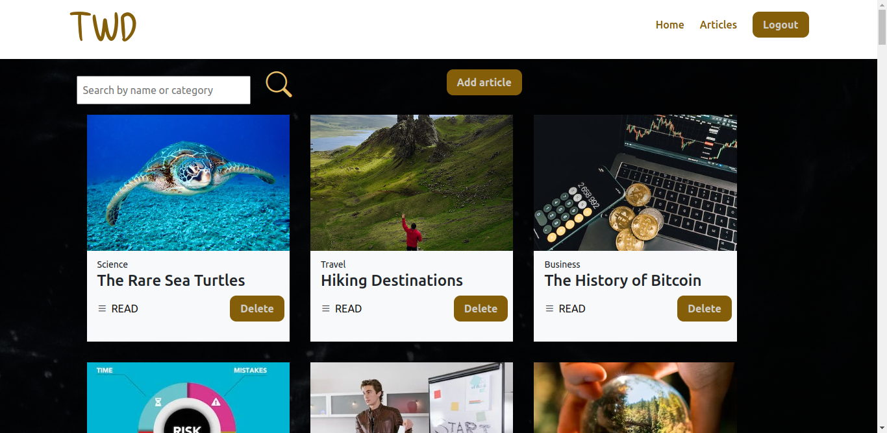
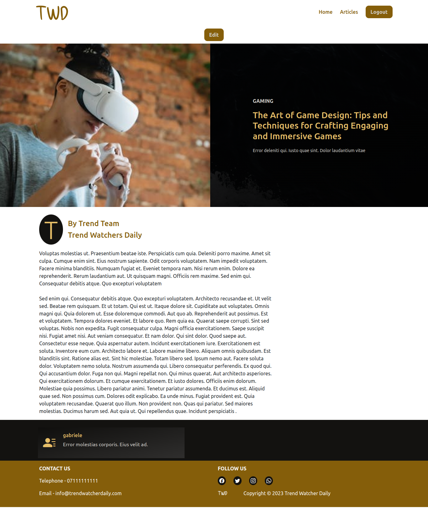

# Trend Watcher Daily
#### A Ruby on Rails API with a React front end

##### Owner
Elizabeth Mwende Muthusi
##### Date
31/03/2023.

### About
This is a magazine outlet that allows users to view and read articles from a collection and leave reviews. An editor for the magazine is able to add, edit and delete an article. The app is built using React Router for client-side routing and uses a ruby on rails API.

### Features
A user can:-
1. Successfully create an account and log in
2. View articles and leave  reviews

An editor can:-
1. Successfully log in
2. View articles and reviews left by users
3. Add, edit or delete an article

#### Technologies used
HTML
CSS
Javascript
React
Ruby on Rails
Bootstrap
Figma

#### Prerequisites
- Node.js, ruby, rails and npm installed on your machine.

### Getting Started
To get started with this application, you need to follow the steps mentioned below and run on the command line:

1. Clone this repository on your local machine
2. Navigate to the project directory in your terminal.
3. Install the required dependencies by running:
```console
$ bundle install
$ npm install --prefix client
```
4. Run the database migrations and seed the database using:
```console
$ rails db:migrate db:seed
```
5. Start the front end and backend silmutaneously by running:
```console
$ foreman start -f Procfile.dev
```
6. The app should now be running on `http://localhost:4000`

As a user, you can sign up and use those credentials to sign in later after logging out

As an editor, these are the credentials to log in to the editor view
- username- editor
- password- 98765
- check the checkbox `log in as editor`

## Screenshots of the Front End Design
 It is divided into two parts; user's view and editor's view

 ### User view

- Homepage

- Category page

- Main article


 ### Editor view
- Homepage

- Category page

- Create article page

- Main article  page with an edit button


#### License
Copyright (c) 2022 Elizabeth Mwende Muthusi.

Permission is hereby granted, free of charge, to any person obtaining a copy of this software and associated documentation files , to deal in the Software without restriction, including without limitation the rights to use, copy, modify, merge, publish, distribute, sublicense, and/or sell copies of the Software, and to permit persons to whom the Software is furnished to do so, subject to the following conditions:

The above copyright notice and this permission notice shall be included in all copies or substantial portions of the Software.

THE SOFTWARE IS PROVIDED "AS IS", WITHOUT WARRANTY OF ANY KIND, EXPRESS OR IMPLIED, INCLUDING BUT NOT LIMITED TO THE WARRANTIES OF MERCHANTABILITY, FITNESS FOR A PARTICULAR PURPOSE AND NONINFRINGEMENT. IN NO EVENT SHALL THE AUTHORS OR COPYRIGHT HOLDERS BE LIABLE FOR ANY CLAIM, DAMAGES OR OTHER LIABILITY, WHETHER IN AN ACTION OF CONTRACT, TORT OR OTHERWISE, ARISING FROM, OUT OF OR IN CONNECTION WITH THE SOFTWARE OR THE USE OR OTHER DEALINGS IN THE SOFTWARE.
